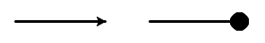

Turtle Properties
=================

Once again, let's create a test turtle called ``bob`` and then explore how to
change its appearance.

.. sourcecode:: python
   :linenos:

   import turtle

   bob = turtle.Turtle()

   Default turtle shape.

The ``turtle`` module contains methods that change the properties of either the
turtle object or the screen object. The table below lists the common methods
used to change the look of what gets drawn. Clicking on any of the keywords
leads to a more detailed description.

.. list-table:: Common Turtle Methods
   :header-rows: 1

   * - Drawing
     - Pen Control
     - Screen Control
   * - :ref:`color() <turtle-color>`
     - :ref:`pensize() <pen-size>`
     - :ref:`setup() <screen-setup>`
   * - :ref:`shape() <turtle-shape>`
     - :ref:`penup() <pen-up-down>`
     - :ref:`bgcolor() <screen-background-color>`
   * - :ref:`speed() <turtle-speed>`
     - :ref:`pendown() <pen-up-down>`
     - :ref:`title() <screen-title>`
   * - :ref:`fillcolor() <turtle-fill>`
     - :ref:`clear() <pen-clear-reset>`
     - :ref:`exitonclick() <screen-exit>`
   * - :ref:`begin_fill() end_fill() <turtle-fill-shape>`
     - :ref:`reset() <pen-clear-reset>`
     - 
   * - :ref:`stamp() <turtle-stamp>`
     - 
     - 

Feel free to experiment with the methods in the three editors below:
:ref:`drawing <draw-try>`, :ref:`pen control <pen-try>`,
:ref:`screen control <screen-try>`.

You can find links to a full list of turtle methods in :ref:`the last section of this
appendix <turtle-links>`.

Drawing Methods
---------------

Besides movement commands like ``forward`` and ``left``, we can also change the
characteristics of the turtle object.

.. _turtle-color:

Turtle Color
^^^^^^^^^^^^

To change the color of the lines, use the syntax:

.. sourcecode:: python

   turtle_name.color('color_name')

Python recognizes a large number of color names, which include standards like
*red, green, blue, cyan*, as well as options like *lightgreen, turquoise,
skyblue*, etc. The best way to tell if Python recognizes a color is to try!

.. index:: ! hex code

Python also accepts a **hex code** instead of a color name. A hex code is a
6-character code that describes how to mix different amounts of red, green, and
blue to produce a specific color. The code must follow a ``#`` character.

.. admonition:: Example

   The following figure shows the result of giving ``bob`` different colors:

   .. sourcecode:: python
      :lineno-start: 5

      bob.pensize(3)                # Set the line thickness to 3 pixels.
      bob.color('red')
      bob.color('purple')
      bob.color('light salmon')     # Yeah, this is a color.
      bob.color('#3c79b8')          # Hex code for LaunchCode blue.

   .. figure:: ./figures/4-turtle-colors.png
      :alt: Image showing red, purple, light salmon and LaunchCode blue.

To see a list of color names that Python recognizes, check out the
`Trinket documentation <https://trinket.io/docs/colors>`__, which provides an
easy grid structure. If none of the colors shown appeal to you, remember that
hex codes let you tinker with the color until you find the exact shade you
want.

.. _turtle-fill:

Fill Color
~~~~~~~~~~

Turtles can also fill the shapes they draw with a particular color. By default,
the fill color and line color are the same, so ``bob.color('blue')`` draws blue
lines and fills shapes with that color.

To change the fill color, use the syntax:

.. sourcecode:: python

   turtle_name.fillcolor('color_name')

Just like with the ``color`` method, ``fillcolor`` recognizes specific color
names, and it also accepts hex codes. Note that the line and fill colors are
both represented by the turtle image on the screen.

.. admonition:: Examples

   The following figure shows the result of giving ``bob`` different fill
   colors. In each case, the line color is black.

   .. sourcecode:: python
      :lineno-start: 5

      bob.pensize(3)                # Set the line thickness to 3 pixels.
      bob.fillcolor('violet')
      bob.fillcolor('yellow')
      bob.fillcolor('white smoke')  # Yeah, this is a color.
      bob.fillcolor('#419f6a')      # Hex code for LaunchCode green.

   .. figure:: ./figures/4-fill-colors.png
      :alt: Image showing violet, yellow, white smoke and LaunchCode blue fill colors.

.. admonition:: Tip

   We can use the ``color`` method to set BOTH the line and fill color by
   using two parameters instead of one.

   .. sourcecode:: python
      :lineno-start: 5

      bob.pensize(3)                      # Set the line thickness to 3 pixels.
      bob.color('black', 'pink')          # Set black line color and pink fill color.
      bob.color('purple', 'gold')
      bob.color('tomato', 'skyblue')
      bob.color('#3c79b8', '#419f6a')     # Hex codes for LaunchCode blue and green.

   .. figure:: ./figures/4-line-fill-colors.png
      :alt: Image showing 4 examples of setting line and fill colors.

.. _turtle-shape:

Turtle Shape
^^^^^^^^^^^^

The Python library offers six choices for a turtle's shape---*'arrow', 'circle',
'classic', 'square', 'triangle',* and *'turtle'*. By default, turtles begin
with the *'classic'* shape.

   Arrow, circle, classic, square, triangle, turtle.

To set the shape for a turtle object, we use the syntax:

.. sourcecode:: python

   turtle_name.shape('shape_name')

``shape_name`` must be one of the six options, and it must be in quotes. For
example, ``bob.shape('circle')`` changes ``bob`` from its default shape to a
circle.

   Classic turtle shape + line vs. circle shape + line.

.. _turtle-speed:

Turtle Speed
^^^^^^^^^^^^

To set how quickly a turtle draws, use the syntax:

.. sourcecode:: python

   turtle_name.speed(speed_value)

``speed_value`` can be set to any integer from 1 (slowest) - 10 (fastest).
Setting ``speed_value`` to 0 skips the drawing animation and instantly shows
the finished shape on the screen.

.. _turtle-fill-shape:

Fill a Shape
^^^^^^^^^^^^

To fill the design drawn by a turtle, use the syntax:

.. sourcecode:: python

   turtle_name.begin_fill()
   # Drawing code
   turtle_name.end_fill()

Lorem ipsum...

.. _turtle-stamp:

Making a Stamp
^^^^^^^^^^^^^^

The ``stamp()`` method leaves a print of the turtle's shape on the page.
Compare the results of the two code samples below. They both result in a line
that is 200 pixels long.

.. sourcecode:: python
   :linenos:

   bob.forward(100)
   bob.forward(100)

   bob.stamp()
   bob.forward(100)
   bob.stamp()
   bob.forward(100)

INSERT FIGURE HERE!!!!

Notice how the second line shows where ``bob`` left an imprint (a stamp)
on the drawing before moving to the next position.

.. _draw-try:

Try It! (Drawing)
^^^^^^^^^^^^^^^^^

   INSERT REPL HERE!!!!

Focus should be on turtle appearance.

Pen Control
-----------

Other methods determine how a turtle draws lines or leaves other marks on the
screen.

.. _pen-size:

Line Thickness (Pen Size)
^^^^^^^^^^^^^^^^^^^^^^^^^

To change the thickness of the lines drawn, use the syntax:

.. sourcecode:: python

   turtle_name.pensize(value)

``value`` sets the number of pixels, and it can be any positive number. The
larger the value, the thicker the lines. By default, turtles start with a
pensize of 1.

.. _pen-up-down:

Penup and Pendown
^^^^^^^^^^^^^^^^^

Two methods control whether or not a turtle draws a line behind itself when it
moves:

.. sourcecode:: python

   turtle_name.penup()
   turtle_name.pendown()

The ``penup()`` method tells a turtle to lift up its tail. Any movement
commands that follow will reposition the turtle but NOT draw any lines.

The ``pendown()`` method does the opposite, drawing lines behind the turtle as
it moves. The ``pendown`` state is the default whenever a new turtle is
created.

.. _pen-clear-reset:

Clear and Reset
^^^^^^^^^^^^^^^

To erase a turtle’s drawings from the screen, use the syntax:

.. sourcecode:: python

   turtle_name.clear()
   # OR
   turtle_name.reset()

Both methods remove only the drawings made by the selected turtle. ``clear()``
keeps settings like color, line thickness, and position the same. ``reset()``
re-centers the turtle on the page and returns most of its properties to their
default values.

.. admonition:: Example

   Watch below as ``clear`` and ``reset`` are applied to two of the turtles.

      [INSERT GIF HERE!!!!]
   
   Which turtle uses ``clear()``, and which one uses ``reset()``?

.. _pen-try:

Try It! (Pen)
^^^^^^^^^^^^^

   INSERT REPL HERE!!!!

Try drawing a dashed line, a stamped line, thick and thin lines, steadily
increasing lines, etc.

Screen Control
--------------

Several methods adjust the drawing space. To use these methods, we must first
define a screen variable.

Just like we defined ``bob`` as a turtle object, we can define the ``screen``
variable to control the drawing space.

.. sourcecode:: python
   :linenos:

   import turtle

   screen = turtle.Screen()

.. _screen-setup:

Set Up
^^^^^^

To set the width and height of the drawing space, use the syntax:

.. sourcecode:: python

   screen_name.setup(width, height)

Both ``width`` and ``height`` must be integers, and they each represent a
number of pixels.

Sometimes ``width`` or ``height`` will be larger than what a device can
display. In this case, the drawing window will include scroll bars to allow the
user to view the entire area.

.. _screen-background-color:

Background Color
^^^^^^^^^^^^^^^^

To change the background color of the drawing space, use the syntax:

.. sourcecode:: python

   screen_name.bgcolor('color_name')

Just like the :ref:`color <turtle-color>` and :ref:`fillcolor <turtle-fill>`
methods, Python accepts color names and hex codes for ``value``.

   [INSERT FIGURE HERE!!!!]

   Screens with red, lightgreen, and gray backgrounds.

.. _screen-title:

Title
^^^^^

To add a title to the drawing window, use the syntax:

.. sourcecode:: python

   screen_name.title('title_text')

``title_text`` must be a string, and it will appear along the top edge of the
window when it opens.

.. _screen-exit:

Exit On Click
^^^^^^^^^^^^^

By default, Python closes the turtle window immediately after the program ends,
which means any cool graphics get lost before we can fully appreciate them. To
prevent this, add a statement at the end of the program that tells Python to
pause before closing the window.

.. sourcecode:: python

   screen_name.exitonclick()

``exitonclick()`` causes the turtle window to stay open until the user clicks
somewhere inside that space.

.. _screen-try:

Try It! (Screen)
^^^^^^^^^^^^^^^^

   INSERT REPL HERE!!!!

Try opening a small/large window, green background, and a unique title.
