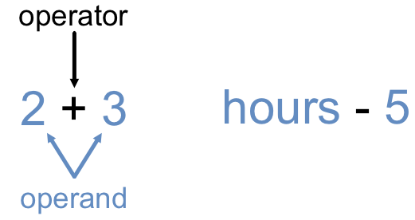
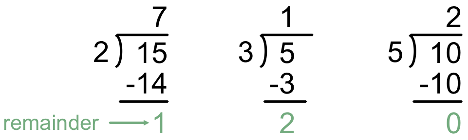

Operators
=========

Now that we know how to store data in variables, let's learn how to create new
values from existing data. Run the following code. It stores values in two
variables, then prints the result of several expressions.

.. raw:: html

   <iframe height="500px" width="100%" src="https://repl.it/@launchcode/LCHS-Math-Operators?lite=true" scrolling="no" frameborder="yes" allowtransparency="true"></iframe>

Try changing one or more of the *operators* in lines 4 - 9 (``+``, ``-``,
``*``, ``/``, ``**``) to display a different output.

An **operator** tells Python to perform an action on two values. Operators may
be a single character (like ``+``), double characters (like ``**``), or
keywords.

The values an operator works on are called **operands**. Operands may be simple
numbers or strings, or they be variables.

When Python finds an operator, it evaluates the expression and *returns* a new
value. When a variable is used in an expression (like ``number_of_days - 5``),
it gets replaced by the value it stores, and then the expression is evaluated.

Math Operators
--------------

The most common operators perform simple math calculations. These behave just
as you expect, and many of the symbols are probably familiar. However, there
are two operators that are commonly used in programming but not much in math
class.

.. index:: ! +, ! -, ! *, ! /, ! **, ! //

.. list-table:: Basic Math Operators
   :widths: auto
   :header-rows: 1

   * - Operator
     - Description
     - Example
   * - ``+``
     - Adds two values (operands)
     - ``2 + 3`` returns ``5``
   * - ``-``
     - Subtracts the first operand by the second
     - ``2 - 3`` returns ``-1``
   * - ``*``
     - Multiplies two operands
     - ``2 * 3`` returns ``6``
   * - ``/``
     - Divides the first operand by the second
     - ``3 / 2`` returns ``1.5``
   * - ``**``
     - Takes the first operand and raises it to the power of the second.
       
       (first value)\ :sup:`second value`
     - ``3 ** 2`` returns ``9``

       ``5 ** 3`` returns ``125``
   * - ``//``
     - Divides the first operand by the second and rounds *down* to a whole number.
     - ``3 // 2`` returns ``1``
   * - ``%``
     - This is called the modulus operator, and it is discussed :ref:`below <modulus>`.
     - ``5 % 2`` returns ``1``

       ``10 % 2`` returns ``0``

The ``//`` Operator
^^^^^^^^^^^^^^^^^^^

Whenever Python performs division ``/``, it returns the value as a ``float``
data type.

.. admonition:: Example

   .. sourcecode:: Python
      :linenos:

      print(3 / 2)
      print(10 / 10)
      print(4 / 3)

   **Console Output**

   ::

      1.5
      1.0
      1.3333333333333333

Even for results that are whole numbers, like ``10/10``, the ``float`` type
contains a decimal.

If we want the result of a division to be an integer, we can convert it
using the ``int()`` function as we saw in the
:ref:`type conversion section <type-conversion>`. In line 2 above, the syntax
would be ``print(int(10 / 10))``, giving an output of ``1`` instead of ``1.0``.

.. index:: ! integer division

This situation, called **integer division**, is common enough that Python gives
us a shortcut with the ``//`` operator. It divides two values and rounds the
result DOWN to the next smallest integer, regardless of any decimal values.

.. admonition:: Example

   .. sourcecode:: Python
      :linenos:

      print(4 / 3, 4 // 3)
      print(99 / 10, 99 // 10)

      print(-3 / 2, -3 // 2)
      print(-99 / 10, -99 // 10)

   **Console Output**

   ::

      1.3333333333333333    1
      9.9    9
      -1.5   -2
      -9.9   -10

.. admonition:: Note

   We need to be careful when we consider negative numbers. *Rounding down*
   means making a larger negative value. While ``9.9`` rounds down to ``9``,
   ``-9.9`` rounds down to ``-10``.

   Also, remember that the ``int()`` function removes the decimals without
   rounding. ``int(-99 / 10)`` returns ``-9``, but ``-99 // 10`` returns
   ``-10``.

.. _modulus:

The ``%`` Operator
^^^^^^^^^^^^^^^^^^^

.. index:: ! modulus, ! %

OK. Be patient. This takes some practice, but it's totally worth it. Let's
start with the definition.

The **modulus** operator (``%``) takes two integers, divides them, and returns
the *remainder*. Consider these examples, which might bring up fond memories
of doing long division:

In the first calculation, 2 does not go into 15 evenly. 2 * 7 = 14, which is
too small, but 2 * 8 = 16, which is too large. 2 goes into 15 seven times, but
this leaves a *remainder* of ``1``. Similarly, 3 goes into 5 one time, leaving
a remainder of 2. Finally, 5 goes into 10 exactly 2 times, with no remainder
left over.

The modulus operator divides the first operand by the second and returns the
value of the remainder. So ``15 % 2`` returns ``1``, ``5 % 3`` returns ``2``,
and ``10 % 5`` returns ``0``.

.. admonition:: Example

   Run the following code to see how ``%`` works.

   .. raw:: html

      <iframe height="550px" width="100%" src="https://repl.it/@launchcode/LCHS-Modulus?lite=true" scrolling="no" frameborder="no" allowtransparency="true"></iframe>

   Try changing the numbers on either side of the ``%`` operator and check the
   results.

Just about every new coder wonders,

   Why would I EVER want to use a modulus?

Well, you will. However, we probably won't convince you right now, at least
with words.

Experience is the best teacher. As you continue with this course, you will
find yourself using ``%`` more than you expect.

.. admonition:: Tip

   An integer, ``num``, is even when ``num % 2`` is ``0``, and it is odd
   when ``num % 2`` is ``1``.

   The value returned by ``a % b`` will be from ``0`` to ``b`` (not including
   ``b``).

Check Your Understanding
------------------------

.. admonition:: Question

   What value is printed when the following statement runs?

   .. sourcecode:: Python

      print(18 / 4)

   .. raw:: html

      <ol type="a">
         <li><input type="radio" name="Q1" autocomplete="off" onclick="evaluateMC(name, true)"> 4.5</li>
         <li><input type="radio" name="Q1" autocomplete="off" onclick="evaluateMC(name, false)"> 5</li>
         <li><input type="radio" name="Q1" autocomplete="off" onclick="evaluateMC(name, false)"> 4</li>
         <li><input type="radio" name="Q1" autocomplete="off" onclick="evaluateMC(name, false)"> 2</li>
      </ol>
      

.. admonition:: Question

   What value is printed when the following statement runs?

   .. sourcecode:: Python

      print(18 // 4)

   .. raw:: html

      <ol type="a">
         <li><input type="radio" name="Q2" autocomplete="off" onclick="evaluateMC(name, false)"> 4.5</li>
         <li><input type="radio" name="Q2" autocomplete="off" onclick="evaluateMC(name, false)"> 5</li>
         <li><input type="radio" name="Q2" autocomplete="off" onclick="evaluateMC(name, true)"> 4</li>
         <li><input type="radio" name="Q2" autocomplete="off" onclick="evaluateMC(name, false)"> 2</li>
      </ol>
      

.. admonition:: Question

   What value is printed when the following statement runs?

   .. sourcecode:: Python

      print(18 % 4)

   .. raw:: html

      <ol type="a">
         <li><input type="radio" name="Q3" autocomplete="off" onclick="evaluateMC(name, false)"> 4.5</li>
         <li><input type="radio" name="Q3" autocomplete="off" onclick="evaluateMC(name, false)"> 5</li>
         <li><input type="radio" name="Q3" autocomplete="off" onclick="evaluateMC(name, false)"> 4</li>
         <li><input type="radio" name="Q3" autocomplete="off" onclick="evaluateMC(name, true)"> 2</li>
      </ol>
      

.. raw:: html

   