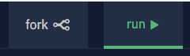

Using This Book
===============

Throughout this book, you will find different types of exercises. Each one
gives you a quick way to review or practice coding. To get the most out of the
book, try ALL of the tasks.

Concept Checks
--------------

Many pages end with a *Check Your Understanding* section, which contains a few
quick questions. You should use these as a review of what you just read.

The concept check questions are partially interactive---you can often click on
your chosen answer(s) to see if you are correct. However, your choices are NOT
saved. Leaving or refreshing the page erases the results.

If you want to save your answers, we recommend keeping a notebook where you can
write down the questions/answers that you find the most important or
interesting.

Try It!
^^^^^^^

.. raw:: html

   

Answer the following practice questions:

.. admonition:: Question

   Multiple Choice: Select the correct option!

   .. raw:: html

      <ol type="a">
         <li><input type="radio" name="Q1" autocomplete="off" onclick="evaluateMC(name, true)"> <strong>Pick this answer!!!</strong></li>
         <li><input type="radio" name="Q1" autocomplete="off" onclick="evaluateMC(name, false)"> Don't choose this answer.</li>
         <li><input type="radio" name="Q1" autocomplete="off" onclick="evaluateMC(name, false)"> Don't choose this answer either.</li>
         <li><input type="radio" name="Q1" autocomplete="off" onclick="evaluateMC(name, false)"> I insist on losing this point.</li>
      </ol>
      

.. admonition:: Question

      Multiple Answers: Try clicking each of the options below.
      
      .. raw:: html
      
         <ol type="a">
            <li>Option a</li>
            <li>Option b</li>
            <li>Option c</li>
            <li>Option d</li>
            <li>Option e</li>
         </ol>

In-Page Examples
----------------

Some sections provide live-coding practice. These short examples include code
you can run and/or modify to quickly reinforce what you just read. Play around
with these!

Try It!
^^^^^^^

.. raw:: html

   <iframe height="600px" width="100%" src="https://repl.it/@launchcode/Embedded-Try-It-Example?lite=true" scrolling="no" frameborder="yes" allowtransparency="true"></iframe>

.. index:: ! repl.it

Longer Examples and End of Chapter Exercises
--------------------------------------------

Longer examples and practice problems have links to **Repl.it**. This website
allows you to write, run and save your code. Repl.it accounts are free, so we
encourage you to `sign up for one <https://repl.it/signup>`__.

As you explore the examples in this book, feel free to make changes to
the code. If you want to save your edits, click the *Fork* button at the top of
the workspace. Repl.it will store a copy of the code in your personal account.

Try It!
^^^^^^^

Here is the same code used in the box above. Click on the link to open it in
the repl.it workspace.

.. replit:: python
   :linenos:
   :slug: Embedded-Try-It-Example

   import turtle

   bob = turtle.Turtle()
   bob.color('blue')
   bob.shape('turtle')

   bob.left(90)
   bob.circle(75)

   # Try changing the color or shape (circle, square, triangle, arrow) for bob.
   # Try changing the size of the circle.

You need to be logged into your repl.it account in order to save any changes
you make to the code.
