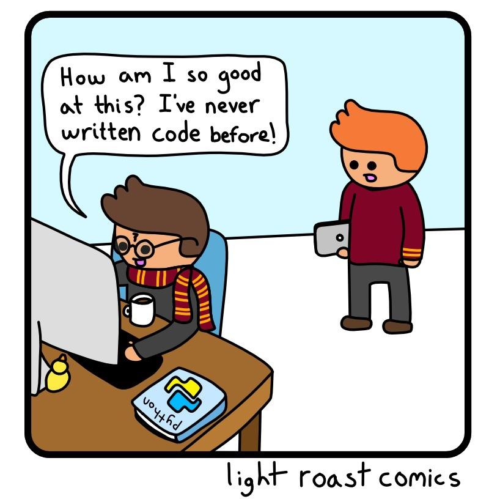
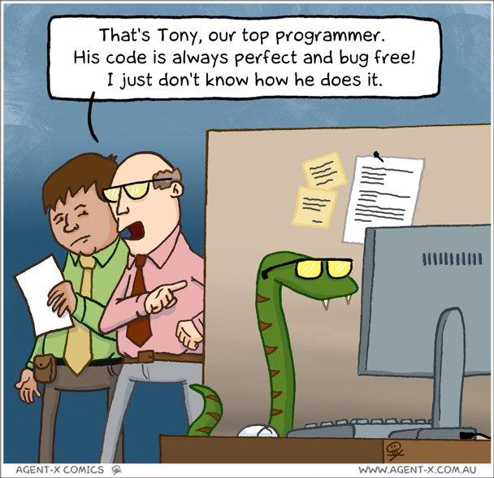

Why Python?
===========

Most programmers have a favorite coding language, but there is NOT a single,
best choice. Each language does some things very well, other things pretty well, and
a few things not so well.

For most tasks, any programming language will do the job. Which one you use
depends on convenience and personal preference. So why start with Python?

Python Is A Friendly First Language
-----------------------------------

If you start typing "Why learn" into the Google search box, one of the top
auto-fill suggestions is "Why learn python". If you continue your search, you
will likely find terms like *elegant*, *flexible*, *most loved*, *beginner
friendly*, and *in demand*.

Take a look at the following code samples, which select a random integer (whole
number) from 1 - 10 and then print it to the screen.

.. admonition:: Examples

   Python:

   .. sourcecode:: python
      :linenos:

      import random

      number = random.randint(1, 10)
      print(number)

   JavaScript:

   .. sourcecode:: JavaScript
      :linenos:

      let number = Math.floor(Math.random()*10) + 1;
      console.log(number);
   
   Java:

   .. sourcecode:: JavaScript
      :linenos:

      public class Main{
         public static void main(String[] args){

            int number;
            
            number = (int) (Math.random()*9) + 1;

            System.out.println(number);

         }
      }

Each code sample does exactly the same thing, but the keywords that Python uses
are very similar to their English meanings. ``random.randint(1, 10)`` can be
read as "select a random integer from 1 - 10", and ``print`` does just what it
says. ``console.log()`` and ``System.out.println()`` are not as clear.

Even though Java is amazingly popular, beginners who start with the language
must learn both fundamental skills as well as the meaning behind ``public
static void main``. Python uses a much simpler vocabulary, which allows new
coders to focus on building their core skills instead of worrying about the
placement of ``{}``, ``;``, and building all code inside *classes*.

Python Does Lots of Things
--------------------------

Even though Python code gets described as a "simple", this is because the
language handles a lot of complexity for you. The nitty-gritty details occur
behind the scenes, allowing you to focus more on getting your ideas to work.
Plus, there is plenty of free, ready-made code that you can pull into your
own Python projects.

.. figure:: figures/coding-essay.jpg
   :alt: Access Python libraries so you don't have to build all of the code yourself.

   If writing code was like an essay...

The hot topics in computing---machine learning, data analysis, web development,
cybersecurity, etc.---can all be done with Python.

Python Makes it Easier to Learn Other Languages
-----------------------------------------------

Once you learn how to code something in Python---like printing to the screen
or asking the user for input---you will recognize the same tasks when they
appear in Java, C++, JavaScript, etc. Even though the structure of the
languages might be unfamiliar, you will still have an idea of what the code is
doing.

This course is different from other ways you can learn Python. It focuses on
programming *fundamentals* and *thinking like a coder*. These skills apply to
ALL programming languages. Once you learn them for Python, you will be able to
reuse those skills when you switch to a different language.

The logic and problem-solving techniques necessary to write programs are
standard. We will teach you how to *code*. Python is simply the tool we use to
do it.

.. figure:: figures/python.png
   :alt: Python is flexible and can be used for small and large applications.
