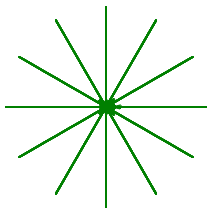

Project: Turtle Loops
=====================

Let's use Python turtles to practice writing loops!

Part A - Polygons and Sprites
-----------------------------

In the chapter, you coded a program to make a turtle draw a *regular polygon*
(a shape with all the sides the same length and all the angles the same). Click
on the link below to open up the starter code in repl.it.

.. replit:: Python
   :slug: LCHS-Turtle-Loops-Project-polygons
   :linenos:

   import turtle

   bob = turtle.Turtle()

   num_sides = 8

   turn_angle = 360.0 / num_sides

   for side in range(num_sides):
      bob.forward(50)
      bob.left(turn_angle)

#. Modify the program to prompt the user to enter the following:

   a. The number of sides for the polygon,
   b. The length for each side.

   .. admonition:: Tip

      ``bob.color('blue')`` changes the color of the lines to blue. Many color
      choices are available. Feel free to play with this feature.

      You can also fill the polygon with a color. Refer to the Turtle Appendix
      for details.

      .. todo:: Insert internal link to the Turtle Appendix.

#. A *sprite* is a spider shaped thing with a certain number of legs coming out
   from a center point.

   .. figure:: figures/sprite-example.gif
      :alt: Gif showing sprites with 3, 5, and 8 legs.

      Sprites with 3, 5, and 8 legs.

   Write a program to draw a sprite, where the number of legs is provided by
   the user. The same ``turn_angle`` calculation applies for both sprites and
   polygons.

   Follow this link to the `starter code <https://repl.it/@launchcode/LCHS-Turtle-Loop-Project-sprites>`__.

Part B - Clock Face
-------------------

Entering a value of ``12`` for the number of sprite legs draws something that
looks a little bit like a clock face:

#. Add the ``.penup()`` and ``.pendown()`` methods to your sprite loop to make
   the drawing look like this:

   .. figure:: figures/sprite-clock-dashes.png
      :alt: Image showing a dashed clock face.

#. Finally, use the ``.stamp()`` method to make a mark at the end of each line.
   Your drawing should look something like this:

   .. figure:: figures/sprite-turtle-clock.png
      :alt: Image showing a clock face with dashes and turtle stamps.

Part C - Nested Loops
---------------------

.. index::
   single: loop; nested

.. index:: ! nested loops

**Nested loops** occur when one loop is placed inside of another. For one
iteration of the *outer loop*, the *inner loop* completes ALL of its
iterations.

.. admonition:: Try It!

   Run the program below and examine the output. Which ``print`` statements
   belong to each loop?

   .. raw:: html

      <iframe height="450px" width="100%" src="https://repl.it/@launchcode/LCHS-Nested-Loop-Example?lite=true" scrolling="no" frameborder="yes" allowtransparency="true"></iframe>

   What happens if you add a third loop inside the second?

Use a nested loop to draw three sprites in a row. The *outer* loop controls the
number and position of the sprites. The *inner* loop draws each sprite.

#. Add the following outer loop code to your sprite program. The outer loop
   should come after your turtle setup and user input statements.

   .. sourcecode:: Python
      :linenos:

      for sprite in range(3):
         turtle_name.penup()
         if sprite != 0:                        # If not the first sprite, move the turtle sideways.
            turtle_name.forward(leg_length*2.5) # Prevents sprite legs from overlapping.

         # Inner loop here.

#. For the inner loop, use your old sprite drawing code. Be sure to indent the
   correct amount!
#. Run your program to make sure it correctly draws 3 sprites in a row, each
   with the user selected number of legs.
#. Modify your program to prompt the user for the number of sprites to draw. As
   an extra touch, stamp the turtle shape in the center of each
   sprite.

Part D - Polygons With Sprites
------------------------------

Use what you learned in parts A - C to draw a polygon with sprites at each
corner (called a *vertex*). Prompt the user to enter both the number of sides
for the polygon and the number of legs for each sprite (these do NOT have to be
the same value).

Fork the starter code `here <https://repl.it/@launchcode/LCHS-Turtle-Loop-Project-part-D>`__.

.. admonition:: Examples

   Here is a square with 8-leg sprites:

   .. figure:: figures/square-with-sprites.png
      :alt: Image showing a square with 8-leg sprites at each vertex.

   Feel free to experiment with the colors of the lines.

   .. figure:: figures/octagon-with-sprites.png
      :alt: Image showing a blue octagon with red 3-leg sprites at each vertex.
      :scale: 80%

Part E - Draw Something New
---------------------------

Your polygon code used the same turn angle each iteration.

Open a new file and paste in the original polygon loop code. Experiment with
changing the number of sides and/or the value (or formula) for the turn angle.
See what interesting shapes you can create.

Add comments to your code so your teacher and classmates can understand how
your program works!

.. list-table:: Try It!
   :widths: auto

   * - .. figure:: figures/spirograph-1.png
          :alt: Image showing one spirograph option (30 lines, 132° turn angle).
     - .. figure:: figures/spirograph-2.png
          :alt: Image showing one spirograph option (20 lines, 198° turn angle).
     - .. figure:: figures/spirograph-3.png
          :alt: Image showing one spirograph option (30 lines, 121° turn angle).

.. admonition:: Note

   You do NOT have to draw the shapes shown above. The goal in this part is
   for you to be creative and discover what you can make on your own!